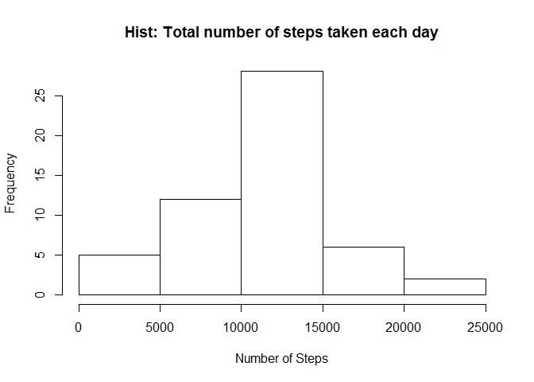
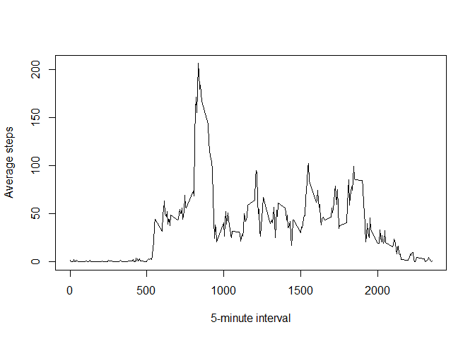
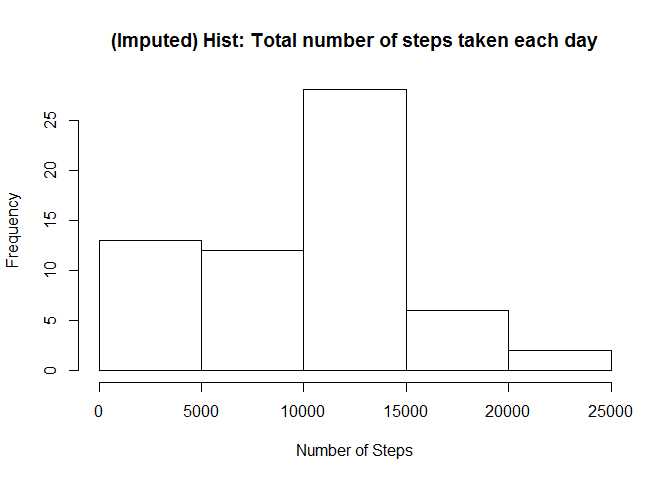
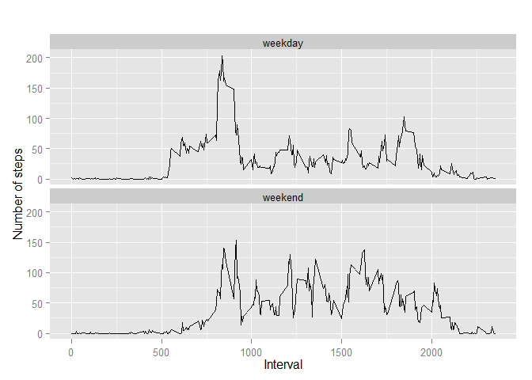

# Reproducible Research: Peer Assessment 1


## Loading and preprocessing the data 

1. Load the data (i.e. read.csv())


```r
temp_dataset <-read.csv(unz("activity.zip", "activity.csv"), header=TRUE, sep=",", stringsAsFactors = FALSE)
```

2. Process/transform the data (if necessary) into a format suitable for your analysis

```r
temp_dataset$date <- as.Date(temp_dataset$date, format="%Y-%m-%d")
```

## What is mean total number of steps taken per day?

For this part of the assignment, you can ignore the missing values in the dataset.   
1. Make a histogram of the total number of steps taken each day


```r
aggregate_steps <- aggregate( steps~date, temp_dataset, sum, na.rm = TRUE )
hist(aggregate_steps$steps, main="Hist: Total number of steps taken each day", xlab="Number of Steps" )
```

 

2. Calculate and report the mean and median total number of steps taken per day

```r
#daily_steps <- tapply(temp_dataset$steps, temp_dataset$date, sum, rm.na =TRUE)
average_daily_mean <- mean(aggregate_steps$steps)
average_daily_median <- median(aggregate_steps$steps)

#or
#summary(aggregate_steps$steps)
```
The total number of steps taken per day:   
Mean: 1.0766189\times 10^{4}    
Median: 10765.   

## What is the average daily activity pattern?
1. Make a time series plot (i.e. type = "l") of the 5-minute interval (x-axis) and the average number of steps taken, averaged across all days (y-axis)

```r
average_interval_steps <- aggregate(steps ~ interval, temp_dataset, mean)
plot(average_interval_steps, xlab= "5-minute interval", ylab= "Average steps", type='l') 
```

 

2. Which 5-minute interval, on average across all the days in the dataset, contains the maximum number of steps?

```r
average_interval_steps_max <- average_interval_steps$interval[which.max(average_interval_steps$steps)]
```
The 5-minute interval which contains the maximum number of steps is 835. 

## Imputing missing values

Note that there are a number of days/intervals where there are missing values (coded as NA). The presence of missing days may introduce bias into some calculations or summaries of the data.

1. Calculate and report the total number of missing values in the dataset (i.e. the total number of rows with NAs)


```r
number_row_NA <- sum(is.na(temp_dataset)) 
```

The total number of missing values in the dataset is 2304. 

2. Devise a strategy for filling in all of the missing values in the dataset. The strategy does not need to be sophisticated. For example, you could use the mean/median for that day, or the mean for that 5-minute interval, etc.

Using the mean for each day to fill up the missing values in the dataset. For days without mean, the value will be 0.


```r
aggregate_steps_mean <- aggregate( steps~date, temp_dataset, mean, na.rm = TRUE )
new_dataset = temp_dataset
for (i in 1:nrow(new_dataset)){
  if (is.na(new_dataset$steps[i])){
    date <- new_dataset$date[i]
    
     if(length(aggregate_steps_mean$steps[which (aggregate_steps_mean$date == date)])== 0){
        #handles when day average is 0 because of NA
        step_val = 0
     }
     else{
        step_val = aggregate_steps_mean$steps[which (aggregate_steps_mean$date == date)]
     }
    new_dataset$steps[i] <- step_val
  }
}
```

3. Create a new dataset that is equal to the original dataset but with the missing data filled in.

Created a new dataset called new_dataset .

4. Make a histogram of the total number of steps taken each day and Calculate and report the mean and median total number of steps taken per day. Do these values differ from the estimates from the first part of the assignment? What is the impact of imputing missing data on the estimates of the total daily number of steps?

a. Histogram of the total number of steps taken each day


```r
aggregate_steps_new <- aggregate( steps~date, new_dataset, sum, na.rm = TRUE )
hist(aggregate_steps_new$steps, main="(Imputed) Hist: Total number of steps taken each day", xlab="Number of Steps" )
```

 

b. Calculate and report the mean and median total number of steps taken per day.


```r
#daily_steps <- tapply(temp_dataset$steps, temp_dataset$date, sum, rm.na =TRUE)
average_daily_mean_new <- mean(aggregate_steps_new$steps)
average_daily_median_new <- median(aggregate_steps_new$steps)

#or
#summary(aggregate_steps$steps)
```
(Imputed) The total number of steps taken per day:   
Mean: 9354.2295082 
Median: 1.0395\times 10^{4}.   

Do these values differ from the estimates from the first part of the assignment?
Yes.

What is the impact of imputing missing data on the estimates of the total daily number of steps?


```r
mean_diff <- average_daily_mean-average_daily_mean_new 
median_diff <- average_daily_median- average_daily_median_new  
```

Mean(Old-new): 1411.959171   
Median(Old-new): 370 

Imputting missing data causes the average daily mean and median to decrease.

## Are there differences in activity patterns between weekdays and weekends?

For this part the weekdays() function may be of some help here. Use the dataset with the filled-in missing values for this part.

1. Create a new factor variable in the dataset with two levels - "weekday" and "weekend" indicating whether a given date is a weekday or weekend day.


```r
new_dataset$daytype <- as.factor(ifelse(weekdays( new_dataset$date) %in% c("Saturday","Sunday"), "weekend", "weekday")) 
```

2. Make a panel plot containing a time series plot (i.e. type = "l") of the 5-minute interval (x-axis) and the average number of steps taken, averaged across all weekday days or weekend days (y-axis). The plot should look something like the following, which was creating using simulated data:


```r
library(ggplot2)

aggregate_steps_daytype <- aggregate(steps ~ interval+daytype, new_dataset, mean)

qplot(interval, steps, data=aggregate_steps_daytype, geom=c("line"), xlab="Interval", ylab="Number of steps", main="") + facet_wrap(~ daytype, ncol=1)
```

 

